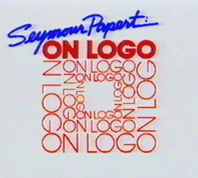
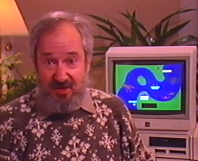

# Seymour Papert: On Logo - Russian version.

Russian translation of the excellent Seymour Papert: On Logo materials.

For original English version please visit:
[Logo Foundation web page](https://el.media.mit.edu/logo-foundation/resources/onlogo/index.html).

---

# Сеймур Пейперт: О Лого.

В 1986 году Сеймур Пейперт, создатель Лого, в сотрудничестве с известным режиссером Уильямом Шварцем и Элизабет Шварц, помощницей руководителя окружных школ Ладью, Миссури, создал серию видеоматериалов Сеймур Паперт: О Лого.

В этой серии видеоматериалов, Пейперт делится своим взглядом на мышление, обучение и преподавание в условиях компьютерной культуры, а также рассматривает технические вопросы Лого и программирования в целом.

Сеймур Пейперт О Лого предоставляет окно в то время когда в течение всего нескольких лет, компьютеры и Лого широко использовались в школах США, а также углубляется в вопросы технологий и образования которые остаются актуальными и сегодня.

Эти 10 видеозаписей серии были опубликоаны на веб странице [Logo Foundation](https://el.media.mit.edu/logo-foundation/resources/onlogo/index.html) для использования в личных и образовательных целях в соотвествии с правилами использования приведёнными ниже. Правила использования идентичны и для настоящего перевода материалов на русский язык.

Серия видеозаписей Сеймур Пейперт О Лого состоит из двух частей: 

* Новый переворот в сознании, сфоркусирована на процессе и принципах обучения.
* Лого Барьеры, описывающая конкретные технические аспекты.

Дополнительные компонент, О Лорайтере, рассматривает конкретную версию Лого, которая была разработана Logo Computer Systems Inc (LCSI), и только что была выпущена в 1985 году.

Кликните по названию для просмотра видео:

##  Новый переворот в сознании
1. [Новый переворот в сознании, кассета 1 Резонансы](NM1.md) 
2. [Новый переворот в сознании, кассета 2 Учение](NM2.md)
3. [Новый переворот в сознании, кассета 3 Мышление](NM3.md)
4. [Новый переворот в сознании, кассета 4 Стили](NM4.md)

##  Препятствия
1. [Препятствия, кассета 1 Лого грамматика](hurdles1.md) 
2. [Препятствия, кассета 2 Имена и переменные](hurdles2.md)
3. [Препятствия, кассета 1 Образы рекурсии](hurdles3.md)
4. [Препятствия, кассета 1 Копаем глубже](hurdles4.md)

##  О Логорайтере
1. [Кассета 1](LW1.md)
1. [Кассета 2](LW2.md)
